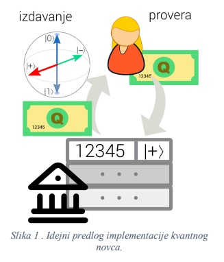
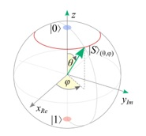

# Quantum-money

The concept of this project is to provide a bank which would use quantum money for protection of falsification 
inspired by the quantum properties such as entanglement, superposition etc. 

Representation of the quantum state of a qubit using bloch's sphere.

## Three entities in the project

We have three main entities: the Issuer(bank), User and the Falsificator. 
In short the bank is supposed to keep track of every money note it gives out 
which will have a 4(max) digit id and a quantum state assigned to it which will 
protect it from theft. How will it do that you're wondering? The quantum state has 
a property that it can't be properly coppied. A way to falsificate would be to 
have the id of a money note, and then by some chance to guess its quantum state by making 
a new quantum state exactly like the one of the money note trying to be falsificated. 
A way to protect the bank from money theft is to introduce more qubits(the same as bits in 
a regular computer which hold a quantum state). The chance of one qubit to be guessed is 75%(3/4). 
By adding more qubits we reduce this probability. By having n qubits the probability for the 
quantum state to be guessed is equal to (3/4)^n. 

## The user interface

To try this app download the quantum_money.py and quantum_money.json. Run the quantum_money.py by 
going to the directory it is saved and type the command "python quantum_money.py" (obviously you need 
python installed on your pc. You can review your money note id's by selecting 1, 2 for requesting  
a money note from the bank, 3 for reviewing the validity of one of your money notes by providing the 
program with the id of the money note, 4 for try of falsification of a money note by providing the id 
of a existing money note you want to try to falsificate and 5 for exit. The project is set to use only one 
qubit so it's likely to falsificate a money note. If you want to increase the security and diminish the 
probability of theft increase the number of qubits.
